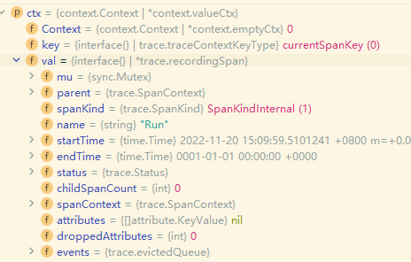

### 建立链路

SDK 官方仓库地址：

[https://github.com/open-telemetry/opentelemetry-go](https://github.com/open-telemetry/opentelemetry-go)

设计一个这样的执行流程：


`Run` 先后执行 `Run1`、`Run2`：

```
	a.Run1(newCtx)
	a.Run2(newCtx)
```


`Run1` 中，还执行了另一个函数 `Run1-1`。


使用 opentelemetry SDK 的代码示例如下：

```go
package main

import (
	"context"
	"go.opentelemetry.io/otel"
	"io"
	"log"
)
// 当前 Trace 的名称。
const name = "App"

type App struct {
	r io.Reader
	l *log.Logger
}

func NewApp(r io.Reader, l *log.Logger) *App {
	return &App{r: r, l: l}
}

func (a *App) Run(ctx context.Context) {
	newCtx, span := otel.Tracer(name).Start(ctx, "Run")
	defer span.End()

	a.Run1(newCtx)
	a.Run2(newCtx)
}

func (a *App) Run1(ctx context.Context) {
	newCtx, span := otel.Tracer(name).Start(ctx, "Run1")
	defer span.End()

	a.Run1_1(newCtx)
}

func (a *App) Run1_1(ctx context.Context) {
	_, span := otel.Tracer(name).Start(ctx, "Run1_1")
	defer span.End()
}

func (a *App) Run2(ctx context.Context) {
	_, span := otel.Tracer(name).Start(ctx, "Run2")
	defer span.End()
}

```


进程中会有多个 Tracer，每个 Tracer 都需要设置一个名称，以便定位信息。


使用 `otel.Tracer(name).Start(ctx, "Run")` 创建新的 Context 的时候， Trace 信息会被附加到  Context 中。

```
	newCtx, span := otel.Tracer(name).Start(ctx, "Run")
```




如果一个函数需要调用其他函数，那么就应该传递链路：

```go
	newCtx, span := otel.Tracer(name).Start(ctx, "Run")
	defer span.End()

	a.Run1(newCtx)
	a.Run2(newCtx)
```


即将 Context 传递给下一个函数。

如果要从当前 Context 获取 Span，可以这样：

```
span := trace.SpanFromContext(ctx)
```


### 导出链路

在上面的例子中，调用函数的过程中，生成了 Trace、Span 信息。

但是还需要导出这些信息才能显示出来。

官方 SDK 或者说中间件支持以下可观测性数据：

| Exporter   | Metrics | Traces |
| ---------- | ------- | ------ |
| Jaeger     |         | ✓      |
| OTLP       | ✓       | ✓      |
| Prometheus | ✓       |        |
| stdout     | ✓       | ✓      |
| Zipkin     |         | ✓      |


在下面的例子中，将使用 `stdout` 将链路信息导出到文件中。

```go
package main

import (
	"context"
	"go.opentelemetry.io/otel"
	"go.opentelemetry.io/otel/attribute"
	"go.opentelemetry.io/otel/exporters/stdout/stdouttrace"
	"go.opentelemetry.io/otel/sdk/resource"
	"go.opentelemetry.io/otel/sdk/trace"
	semconv "go.opentelemetry.io/otel/semconv/v1.10.0"
	"io"
	"log"
	"os"
)

// 创建 Exporter
func newExporter(w io.Writer) (trace.SpanExporter, error) {
	return stdouttrace.New(
		stdouttrace.WithWriter(w),
		// Use human readable output.
		stdouttrace.WithPrettyPrint(),
		// Do not print timestamps for the demo.
		stdouttrace.WithoutTimestamps(),
	)
}

// 创建表示当前进程的 Resource 对象
func newResource() *resource.Resource {
	r, _ := resource.Merge(
		resource.Default(),
		resource.NewWithAttributes(
			semconv.SchemaURL,
			semconv.ServiceNameKey.String("example1"),
			semconv.ServiceVersionKey.String("v0.1.0"),
			attribute.String("environment", "demo"), // 添加 attribute
		),
	)
	return r
}

func main() {
	l := log.New(os.Stdout, "", 0)

	// trace 导出到文件
	f, err := os.Create("traces.txt")
	if err != nil {
		l.Fatal(err)
	}
	defer f.Close()

	// 创建一个 Exporter
	exp, err := newExporter(f)
	if err != nil {
		l.Fatal(err)
	}

	// 创建 TracerProvider
	tp := trace.NewTracerProvider(
		trace.WithBatcher(exp),
		trace.WithResource(newResource()),
	)
	defer func() {
		if err := tp.Shutdown(context.Background()); err != nil {
			l.Fatal(err)
		}
	}()
	otel.SetTracerProvider(tp)

	app := NewApp(os.Stdin, l)
	app.Run(context.Background())
}
```


首先是为了标识当前程序，需要创建一个 Resource。

```go
// 创建表示当前进程的 Resource 对象
func newResource() *resource.Resource {
	r, _ := resource.Merge(
		resource.Default(),
		resource.NewWithAttributes(
			semconv.SchemaURL,
			semconv.ServiceNameKey.String("example1"),
			semconv.ServiceVersionKey.String("v0.1.0"),
			attribute.String("environment", "demo"), // 添加 attribute
		),
	)
	return r
}
```


创建一个 Exporter，当前使用了文件 IO 。

```go
// 创建 Exporter
func newExporter(w io.Writer) (trace.SpanExporter, error) {
	return stdouttrace.New(
		stdouttrace.WithWriter(w),
		// Use human readable output.
		stdouttrace.WithPrettyPrint(),
		// Do not print timestamps for the demo.
		stdouttrace.WithoutTimestamps(),
	)
}
```

> ```go
> func newExporter(ctx context.Context)  /* (someExporter.Exporter, error) */ {
> 	// Your preferred exporter: console, jaeger, zipkin, OTLP, etc.
> }
> ```


创建 TracerProvider：

```go
	// 创建 trace
	tp := trace.NewTracerProvider(
		trace.WithBatcher(exp),	// exporter
		trace.WithResource(newResource()),
	)
```


设置全局 TracerProvider：

```
	otel.SetTracerProvider(tp)
```


启动后，生成的 Trace：

```json
{
	"Name": "Run1_1",
	"SpanContext": {
		"TraceID": "50cf661b85718ec74a4d859f4c1aeef8",
		"SpanID": "7f51afb5a078006e",
		"TraceFlags": "01",
		"TraceState": "",
		"Remote": false
	},
	"Parent": {
		"TraceID": "50cf661b85718ec74a4d859f4c1aeef8",
		"SpanID": "11b82f4e7829ed50",
		"TraceFlags": "01",
		"TraceState": "",
		"Remote": false
	},
	"SpanKind": 1,
	"StartTime": "0001-01-01T00:00:00Z",
	"EndTime": "0001-01-01T00:00:00Z",
	"Attributes": null,
	"Events": null,
	"Links": null,
	"Status": {
		"Code": "Unset",
		"Description": ""
	},
	"DroppedAttributes": 0,
	"DroppedEvents": 0,
	"DroppedLinks": 0,
	"ChildSpanCount": 0,
	"Resource": null,
	"InstrumentationLibrary": {
		"Name": "App",
		"Version": "",
		"SchemaURL": ""
	}
}
{
	"Name": "Run1",
	"SpanContext": {
		"TraceID": "50cf661b85718ec74a4d859f4c1aeef8",
		"SpanID": "11b82f4e7829ed50",
		"TraceFlags": "01",
		"TraceState": "",
		"Remote": false
	},
	"Parent": {
		"TraceID": "50cf661b85718ec74a4d859f4c1aeef8",
		"SpanID": "bd024e7b63a2de62",
		"TraceFlags": "01",
		"TraceState": "",
		"Remote": false
	},
	"SpanKind": 1,
	"StartTime": "0001-01-01T00:00:00Z",
	"EndTime": "0001-01-01T00:00:00Z",
	"Attributes": null,
	"Events": null,
	"Links": null,
	"Status": {
		"Code": "Unset",
		"Description": ""
	},
	"DroppedAttributes": 0,
	"DroppedEvents": 0,
	"DroppedLinks": 0,
	"ChildSpanCount": 1,
	"Resource": null,
	"InstrumentationLibrary": {
		"Name": "App",
		"Version": "",
		"SchemaURL": ""
	}
}
{
	"Name": "Run2",
	"SpanContext": {
		"TraceID": "50cf661b85718ec74a4d859f4c1aeef8",
		"SpanID": "bc9c29add7a9b100",
		"TraceFlags": "01",
		"TraceState": "",
		"Remote": false
	},
	"Parent": {
		"TraceID": "50cf661b85718ec74a4d859f4c1aeef8",
		"SpanID": "bd024e7b63a2de62",
		"TraceFlags": "01",
		"TraceState": "",
		"Remote": false
	},
	"SpanKind": 1,
	"StartTime": "0001-01-01T00:00:00Z",
	"EndTime": "0001-01-01T00:00:00Z",
	"Attributes": null,
	"Events": null,
	"Links": null,
	"Status": {
		"Code": "Unset",
		"Description": ""
	},
	"DroppedAttributes": 0,
	"DroppedEvents": 0,
	"DroppedLinks": 0,
	"ChildSpanCount": 0,
	"Resource": null,
	"InstrumentationLibrary": {
		"Name": "App",
		"Version": "",
		"SchemaURL": ""
	}
}
{
	"Name": "Run",
	"SpanContext": {
		"TraceID": "50cf661b85718ec74a4d859f4c1aeef8",
		"SpanID": "bd024e7b63a2de62",
		"TraceFlags": "01",
		"TraceState": "",
		"Remote": false
	},
	"Parent": {
		"TraceID": "00000000000000000000000000000000",
		"SpanID": "0000000000000000",
		"TraceFlags": "00",
		"TraceState": "",
		"Remote": false
	},
	"SpanKind": 1,
	"StartTime": "0001-01-01T00:00:00Z",
	"EndTime": "0001-01-01T00:00:00Z",
	"Attributes": null,
	"Events": null,
	"Links": null,
	"Status": {
		"Code": "Unset",
		"Description": ""
	},
	"DroppedAttributes": 0,
	"DroppedEvents": 0,
	"DroppedLinks": 0,
	"ChildSpanCount": 2,
	"Resource": null,
	"InstrumentationLibrary": {
		"Name": "App",
		"Version": "",
		"SchemaURL": ""
	}
}

```


### 其他常用方法

**Span 添加属性**

可以向 Span 添加 `k/v` 信息：

```go
	var myKey = attribute.Key("myCoolAttribute")
	span.SetAttributes(myKey.String("a value"))
```

```go
func (a *App) Run(ctx context.Context) {
	newCtx, span := otel.Tracer(name).Start(ctx, "Run")
	defer span.End()
	var myKey = attribute.Key("myCoolAttribute")
	span.SetAttributes(myKey.String("a value"))
	a.Run1(newCtx)
	a.Run2(newCtx)
}
```


**添加事件**

添加简单的事件信息，表示在当前执行了何种操作。

```go
span.AddEvent("Acquiring lock")
mutex.Lock()
span.AddEvent("Got lock, doing work...")
// do stuff
span.AddEvent("Unlocking")
mutex.Unlock()
```


**Span 添加状态**

如果当前函数执行有问题，可以向 Span 添加状态以及记录错误信息。

```go
result, err := operationThatCouldFail()
if err != nil {
	span.SetStatus(codes.Error, "operationThatCouldFail failed")
	span.RecordError(err)
}
```

